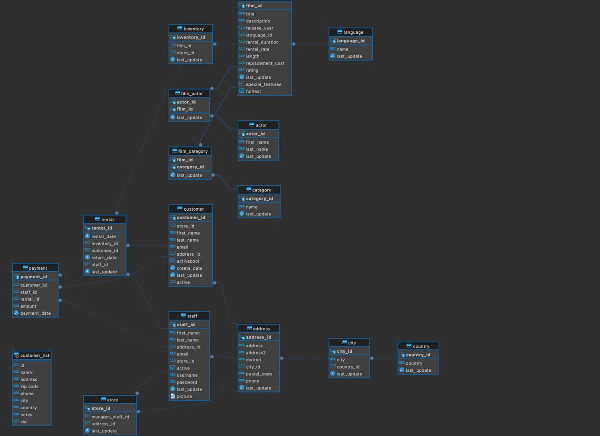

# Домашнее задание #4 (SQL)
## Подготовил студент МСМТ 243 Липатов Данила

## Диаграмма из под DBVEAR
Ниже представлена диаграмма таблиц в DBVEAR, далее все расчет проводились в PGADMIN. \
Для удобства вывода, скриншоты перевел в MD формат с автоматическим выводом всех таблиц, так как небольшие \
При необохидимости, могу добавить изображение результатов.


## Задание 1

### Запрос:
```sql
-- Вывести список всех клиентов (customer)
-- Мы просто выбираем все колонки из таблицы customer.
SELECT * FROM customer;
```

### Результат:
| customer_id | store_id | first_name | last_name | email | address_id | activebool | create_date | last_update | active |
| --- | --- | --- | --- | --- | --- | --- | --- | --- | --- |
| 524 | 1 | Jared | Ely | jared.ely@sakilacustomer.org | 530 | True | 2006-02-14 | 2013-05-26 14:49:45.738000 | 1 |
| 1 | 1 | Mary | Smith | mary.smith@sakilacustomer.org | 5 | True | 2006-02-14 | 2013-05-26 14:49:45.738000 | 1 |
| 2 | 1 | Patricia | Johnson | patricia.johnson@sakilacustomer.org | 6 | True | 2006-02-14 | 2013-05-26 14:49:45.738000 | 1 |
| 3 | 1 | Linda | Williams | linda.williams@sakilacustomer.org | 7 | True | 2006-02-14 | 2013-05-26 14:49:45.738000 | 1 |
| 4 | 2 | Barbara | Jones | barbara.jones@sakilacustomer.org | 8 | True | 2006-02-14 | 2013-05-26 14:49:45.738000 | 1 |
| 5 | 1 | Elizabeth | Brown | elizabeth.brown@sakilacustomer.org | 9 | True | 2006-02-14 | 2013-05-26 14:49:45.738000 | 1 |
| 6 | 2 | Jennifer | Davis | jennifer.davis@sakilacustomer.org | 10 | True | 2006-02-14 | 2013-05-26 14:49:45.738000 | 1 |
| 7 | 1 | Maria | Miller | maria.miller@sakilacustomer.org | 11 | True | 2006-02-14 | 2013-05-26 14:49:45.738000 | 1 |
| 8 | 2 | Susan | Wilson | susan.wilson@sakilacustomer.org | 12 | True | 2006-02-14 | 2013-05-26 14:49:45.738000 | 1 |
| 9 | 2 | Margaret | Moore | margaret.moore@sakilacustomer.org | 13 | True | 2006-02-14 | 2013-05-26 14:49:45.738000 | 1 |
| 10 | 1 | Dorothy | Taylor | dorothy.taylor@sakilacustomer.org | 14 | True | 2006-02-14 | 2013-05-26 14:49:45.738000 | 1 |
| 11 | 2 | Lisa | Anderson | lisa.anderson@sakilacustomer.org | 15 | True | 2006-02-14 | 2013-05-26 14:49:45.738000 | 1 |
| 12 | 1 | Nancy | Thomas | nancy.thomas@sakilacustomer.org | 16 | True | 2006-02-14 | 2013-05-26 14:49:45.738000 | 1 |
| 13 | 2 | Karen | Jackson | karen.jackson@sakilacustomer.org | 17 | True | 2006-02-14 | 2013-05-26 14:49:45.738000 | 1 |
| 14 | 2 | Betty | White | betty.white@sakilacustomer.org | 18 | True | 2006-02-14 | 2013-05-26 14:49:45.738000 | 1 |
| 15 | 1 | Helen | Harris | helen.harris@sakilacustomer.org | 19 | True | 2006-02-14 | 2013-05-26 14:49:45.738000 | 1 |
| 16 | 2 | Sandra | Martin | sandra.martin@sakilacustomer.org | 20 | True | 2006-02-14 | 2013-05-26 14:49:45.738000 | 0 |
| 17 | 1 | Donna | Thompson | donna.thompson@sakilacustomer.org | 21 | True | 2006-02-14 | 2013-05-26 14:49:45.738000 | 1 |
| 18 | 2 | Carol | Garcia | carol.garcia@sakilacustomer.org | 22 | True | 2006-02-14 | 2013-05-26 14:49:45.738000 | 1 |
| 19 | 1 | Ruth | Martinez | ruth.martinez@sakilacustomer.org | 23 | True | 2006-02-14 | 2013-05-26 14:49:45.738000 | 1 |
| 20 | 2 | Sharon | Robinson | sharon.robinson@sakilacustomer.org | 24 | True | 2006-02-14 | 2013-05-26 14:49:45.738000 | 1 |
| 21 | 1 | Michelle | Clark | michelle.clark@sakilacustomer.org | 25 | True | 2006-02-14 | 2013-05-26 14:49:45.738000 | 1 |
| 22 | 1 | Laura | Rodriguez | laura.rodriguez@sakilacustomer.org | 26 | True | 2006-02-14 | 2013-05-26 14:49:45.738000 | 1 |
| 23 | 2 | Sarah | Lewis | sarah.lewis@sakilacustomer.org | 27 | True | 2006-02-14 | 2013-05-26 14:49:45.738000 | 1 |
| 24 | 2 | Kimberly | Lee | kimberly.lee@sakilacustomer.org | 28 | True | 2006-02-14 | 2013-05-26 14:49:45.738000 | 1 |
| 25 | 1 | Deborah | Walker | deborah.walker@sakilacustomer.org | 29 | True | 2006-02-14 | 2013-05-26 14:49:45.738000 | 1 |
| 26 | 2 | Jessica | Hall | jessica.hall@sakilacustomer.org | 30 | True | 2006-02-14 | 2013-05-26 14:49:45.738000 | 1 |
| 27 | 2 | Shirley | Allen | shirley.allen@sakilacustomer.org | 31 | True | 2006-02-14 | 2013-05-26 14:49:45.738000 | 1 |
| 28 | 1 | Cynthia | Young | cynthia.young@sakilacustomer.org | 32 | True | 2006-02-14 | 2013-05-26 14:49:45.738000 | 1 |
| 29 | 2 | Angela | Hernandez | angela.hernandez@sakilacustomer.org | 33 | True | 2006-02-14 | 2013-05-26 14:49:45.738000 | 1 |

*(Показано 30 строк из 599 для компактности)*

---
## Задание 2

### Запрос:
```sql
-- Вывести список имен и фамилий клиентов с именем Carolyn
-- Используем фильтрацию WHERE по колонке first_name.
SELECT first_name, last_name 
FROM customer 
WHERE first_name = 'Carolyn';
```

### Результат:
| first_name | last_name |
| --- | --- |
| Carolyn | Perez |

---
## Задание 3

### Запрос:
```sql
-- Вывести полные имена клиентов (имя + фамилия), имя или фамилия которых содержит “ary”
-- Используем оператор LIKE для поиска подстроки 'ary' (с учетом регистра или ILIKE без учета)
-- Оператор || используется для конкатенации строк со пробелом.
SELECT first_name || ' ' || last_name AS full_name
FROM customer
WHERE first_name ILIKE '%ary%' OR last_name ILIKE '%ary%';
```

### Результат:
| full_name |
| --- |
| Mary Smith |
| Rosemary Schmidt |
| Richard Mccrary |
| Gary Coy |
| Tim Cary |
| Zachary Hite |
| Ruben Geary |
| Adrian Clary |
| Daryl Larue |

---
## Задание 4

### Запрос:
```sql
-- Вывести 20 самых крупных транзакций (payment)
-- Сортируем по полю amount по убыванию и ограничиваем вывод с помощью LIMIT 20.
SELECT *
FROM payment
ORDER BY amount DESC
LIMIT 20;
```

### Результат:
| payment_id | customer_id | staff_id | rental_id | amount | payment_date |
| --- | --- | --- | --- | --- | --- |
| 22650 | 204 | 2 | 15415 | 11.99 | 2007-03-22 22:17:22.996577 |
| 29136 | 13 | 2 | 8831 | 11.99 | 2007-04-29 21:06:07.996577 |
| 28814 | 592 | 1 | 3973 | 11.99 | 2007-04-06 21:26:57.996577 |
| 24553 | 195 | 2 | 16040 | 11.99 | 2007-03-23 20:47:59.996577 |
| 20403 | 362 | 1 | 14759 | 11.99 | 2007-03-21 21:57:24.996577 |
| 24866 | 237 | 2 | 11479 | 11.99 | 2007-03-02 20:46:39.996577 |
| 23757 | 116 | 2 | 14763 | 11.99 | 2007-03-21 22:02:26.996577 |
| 28799 | 591 | 2 | 4383 | 11.99 | 2007-04-07 19:14:17.996577 |
| 20152 | 336 | 1 | 15073 | 10.99 | 2007-03-22 09:29:41.996577 |
| 18272 | 544 | 2 | 1434 | 10.99 | 2007-02-15 16:59:12.996577 |
| 19764 | 292 | 1 | 12739 | 10.99 | 2007-03-18 20:43:44.996577 |
| 18290 | 550 | 1 | 3272 | 10.99 | 2007-02-21 03:46:53.996577 |
| 19815 | 297 | 1 | 12472 | 10.99 | 2007-03-18 10:27:14.996577 |
| 19856 | 301 | 1 | 15201 | 10.99 | 2007-03-22 14:53:08.996577 |
| 20244 | 345 | 1 | 14702 | 10.99 | 2007-03-21 19:28:29.996577 |
| 18153 | 511 | 2 | 2966 | 10.99 | 2007-02-20 06:07:59.996577 |
| 18175 | 516 | 1 | 1718 | 10.99 | 2007-02-16 13:20:28.996577 |
| 19336 | 221 | 1 | 2660 | 10.99 | 2007-02-19 09:18:28.996577 |
| 19481 | 260 | 1 | 2091 | 10.99 | 2007-02-17 16:37:30.996577 |
| 18367 | 572 | 2 | 1889 | 10.99 | 2007-02-17 02:33:38.996577 |

---
## Задание 5

### Запрос:
```sql
-- Вывести адреса всех магазинов (подзапрос)
-- Используем подзапрос к таблице store, чтобы получить address_id, а затем выводим адреса.
SELECT address
FROM address
WHERE address_id IN (SELECT address_id FROM store);
```

### Результат:
| address |
| --- |
| 47 MySakila Drive |
| 28 MySQL Boulevard |

---
## Задание 6

### Запрос:
```sql
-- Вывести число, месяц и день недели в числовом эквиваленте для каждой оплаты
-- Функция EXTRACT позволяет получить нужные части даты из поля payment_date.
-- Для дня недели (isodow): 1 - Понедельник, 7 - Воскресенье.
SELECT 
    EXTRACT(day FROM payment_date) AS payment_day,
    EXTRACT(month FROM payment_date) AS payment_month,
    EXTRACT(isodow FROM payment_date) AS payment_dow
FROM payment;
```

### Результат:
| payment_day | payment_month | payment_dow |
| --- | --- | --- |
| 15 | 2 | 4 |
| 16 | 2 | 5 |
| 16 | 2 | 5 |
| 19 | 2 | 1 |
| 20 | 2 | 2 |
| 21 | 2 | 3 |
| 17 | 2 | 6 |
| 20 | 2 | 2 |
| 20 | 2 | 2 |
| 16 | 2 | 5 |
| 16 | 2 | 5 |
| 17 | 2 | 6 |
| 17 | 2 | 6 |
| 18 | 2 | 7 |
| 20 | 2 | 2 |
| 21 | 2 | 3 |
| 15 | 2 | 4 |
| 15 | 2 | 4 |
| 16 | 2 | 5 |
| 15 | 2 | 4 |
| 15 | 2 | 4 |
| 16 | 2 | 5 |
| 19 | 2 | 1 |
| 17 | 2 | 6 |
| 21 | 2 | 3 |
| 21 | 2 | 3 |
| 16 | 2 | 5 |
| 18 | 2 | 7 |
| 20 | 2 | 2 |
| 20 | 2 | 2 |

*(Показано 30 строк из 14596 для компактности)*

---
## Задание 7

### Запрос:
```sql
-- Вывести кто, когда (привести к типу date) и у кого брал диски в аренду в Июне 2005
-- Фильтруем данные за июнь 2005 года и приводим timestamp к типу date с помощью ::date.
SELECT 
    customer_id, 
    rental_date::date AS rental_date, 
    staff_id
FROM rental
WHERE rental_date >= '2005-06-01' AND rental_date < '2005-07-01';
```

### Результат:
| customer_id | rental_date | staff_id |
| --- | --- | --- |
| 416 | 2005-06-14 | 2 |
| 516 | 2005-06-14 | 1 |
| 239 | 2005-06-14 | 2 |
| 285 | 2005-06-14 | 1 |
| 310 | 2005-06-14 | 1 |
| 592 | 2005-06-14 | 1 |
| 49 | 2005-06-14 | 1 |
| 264 | 2005-06-14 | 2 |
| 46 | 2005-06-14 | 1 |
| 323 | 2005-06-14 | 2 |
| 481 | 2005-06-14 | 1 |
| 139 | 2005-06-14 | 2 |
| 595 | 2005-06-14 | 2 |
| 284 | 2005-06-14 | 2 |
| 306 | 2005-06-14 | 1 |
| 191 | 2005-06-14 | 2 |
| 95 | 2005-06-15 | 2 |
| 197 | 2005-06-15 | 2 |
| 512 | 2005-06-15 | 1 |
| 210 | 2005-06-15 | 2 |
| 279 | 2005-06-15 | 2 |
| 119 | 2005-06-15 | 1 |
| 432 | 2005-06-15 | 2 |
| 546 | 2005-06-15 | 2 |
| 196 | 2005-06-15 | 1 |
| 329 | 2005-06-15 | 1 |
| 295 | 2005-06-15 | 2 |
| 1 | 2005-06-15 | 2 |
| 368 | 2005-06-15 | 1 |
| 334 | 2005-06-15 | 1 |

*(Показано 30 строк из 2311 для компактности)*

---
## Задание 8

### Запрос:
```sql
-- Фильмы выпущенные после 2000 года, длительностью от 60 до 120 мин. Первые 20 по длительности.
-- Применяем множественные условия в WHERE, сортировку ORDER BY и LIMIT.
SELECT title, description, length
FROM film
WHERE release_year > 2000 
  AND length BETWEEN 60 AND 120
ORDER BY length DESC
LIMIT 20;
```

### Результат:
| title | description | length |
| --- | --- | --- |
| Dolls Rage | A Thrilling Display of a Pioneer And a Frisbee who must Escape a Teacher in The Outback | 120 |
| Lock Rear | A Thoughtful Character Study of a Squirrel And a Technical Writer who must Outrace a Student in Ancient Japan | 120 |
| Calendar Gunfight | A Thrilling Drama of a Frisbee And a Lumberjack who must Sink a Man in Nigeria | 120 |
| Dazed Punk | A Action-Packed Story of a Pioneer And a Technical Writer who must Discover a Forensic Psychologist in An Abandoned Amusement Park | 120 |
| Order Betrayed | A Amazing Saga of a Dog And a A Shark who must Challenge a Cat in The Sahara Desert | 120 |
| Karate Moon | A Astounding Yarn of a Womanizer And a Dog who must Reach a Waitress in A MySQL Convention | 120 |
| Untouchables Sunrise | A Amazing Documentary of a Woman And a Astronaut who must Outrace a Teacher in An Abandoned Fun House | 120 |
| Rage Games | A Fast-Paced Saga of a Astronaut And a Secret Agent who must Escape a Hunter in An Abandoned Amusement Park | 120 |
| Command Darling | A Awe-Inspiring Tale of a Forensic Psychologist And a Woman who must Challenge a Database Administrator in Ancient Japan | 120 |
| Identity Lover | A Boring Tale of a Composer And a Mad Cow who must Defeat a Car in The Outback | 119 |
| Apocalypse Flamingos | A Astounding Story of a Dog And a Squirrel who must Defeat a Woman in An Abandoned Amusement Park | 119 |
| Dumbo Lust | A Touching Display of a Feminist And a Dentist who must Conquer a Husband in The Gulf of Mexico | 119 |
| Games Bowfinger | A Astounding Documentary of a Butler And a Explorer who must Challenge a Butler in A Monastery | 119 |
| Strangers Graffiti | A Brilliant Character Study of a Secret Agent And a Man who must Find a Cat in The Gulf of Mexico | 119 |
| Bugsy Song | A Awe-Inspiring Character Study of a Secret Agent And a Boat who must Find a Squirrel in The First Manned Space Station | 119 |
| Fidelity Devil | A Awe-Inspiring Drama of a Technical Writer And a Composer who must Reach a Pastry Chef in A U-Boat | 118 |
| Backlash Undefeated | A Stunning Character Study of a Mad Scientist And a Mad Cow who must Kill a Car in A Monastery | 118 |
| Paths Control | A Astounding Documentary of a Butler And a Cat who must Find a Frisbee in Ancient China | 118 |
| Jawbreaker Brooklyn | A Stunning Reflection of a Boat And a Pastry Chef who must Succumb a A Shark in A Jet Boat | 118 |
| Orient Closer | A Astounding Epistle of a Technical Writer And a Teacher who must Fight a Squirrel in The Sahara Desert | 118 |

---
## Задание 9

### Запрос:
```sql
-- Платежи в апреле 2007, стоимость не превышает 4 доллара. По убыванию стоимости.
-- Сортируем по amount DESC, а при совпадении - по payment_date ASC.
SELECT payment_id, payment_date::date AS payment_date, amount
FROM payment
WHERE payment_date >= '2007-04-01' AND payment_date < '2007-05-01'
  AND amount <= 4
ORDER BY amount DESC, payment_date ASC;
```

### Результат:
| payment_id | payment_date | amount |
| --- | --- | --- |
| 26486 | 2007-04-05 | 3.99 |
| 29361 | 2007-04-05 | 3.99 |
| 25186 | 2007-04-05 | 3.99 |
| 26100 | 2007-04-05 | 3.99 |
| 25451 | 2007-04-06 | 3.99 |
| 27253 | 2007-04-06 | 3.99 |
| 31734 | 2007-04-06 | 3.99 |
| 27239 | 2007-04-06 | 3.99 |
| 26692 | 2007-04-06 | 3.99 |
| 31855 | 2007-04-06 | 3.99 |
| 27743 | 2007-04-06 | 3.99 |
| 26856 | 2007-04-06 | 3.99 |
| 29116 | 2007-04-06 | 3.99 |
| 26190 | 2007-04-06 | 3.99 |
| 25360 | 2007-04-06 | 3.99 |
| 30243 | 2007-04-06 | 3.99 |
| 30836 | 2007-04-06 | 3.99 |
| 26261 | 2007-04-06 | 3.99 |
| 31127 | 2007-04-06 | 3.99 |
| 25387 | 2007-04-06 | 3.99 |
| 29224 | 2007-04-06 | 3.99 |
| 28498 | 2007-04-06 | 3.99 |
| 29806 | 2007-04-06 | 3.99 |
| 29094 | 2007-04-06 | 3.99 |
| 28405 | 2007-04-06 | 3.99 |
| 25638 | 2007-04-06 | 3.99 |
| 29198 | 2007-04-06 | 3.99 |
| 29990 | 2007-04-06 | 3.99 |
| 26704 | 2007-04-06 | 3.99 |
| 30540 | 2007-04-07 | 3.99 |

*(Показано 30 строк из 3454 для компактности)*

---
## Задание 10

### Запрос:
```sql
-- Имена, фамилии и идентификаторы клиентов с именами Jack, Bob, Sara, фамилия с "p"
-- Переименовываем колонки с помощью AS "Имя". Сортировка по возрастанию id.
SELECT 
    first_name AS "Имя", 
    last_name AS "Фамилия", 
    customer_id AS "Идентификатор"
FROM customer
WHERE first_name IN ('Jack', 'Bob', 'Sara')
  AND last_name ILIKE '%p%'
ORDER BY customer_id ASC;
```

### Результат:
| Имя | Фамилия | Идентификатор |
| --- | --- | --- |
| Sara | Perry | 84 |
| Bob | Pfeiffer | 564 |

---
## Задание 11

### Запрос:
```sql
-- Создать таблицу студентов(id, имя, фамилия, возраст, дата рождения, адрес)
-- Выполняем набор DDL (Data Definition Language) и DML (Data Manipulation Language) команд.

-- 1. Создание таблицы с ограничением NOT NULL
CREATE TABLE student (
    id SERIAL PRIMARY KEY,
    first_name VARCHAR(50) NOT NULL,
    last_name VARCHAR(50) NOT NULL,
    age INT NOT NULL,
    birth_date DATE NOT NULL,
    address VARCHAR(200) NOT NULL
);

-- 2. Вносим 1 студента с id > 50
INSERT INTO student (id, first_name, last_name, age, birth_date, address)
VALUES (51, 'Ivan', 'Ivanov', 20, '2004-05-15', 'Moscow, Pushkin st.');

-- 3. Вывод записей
SELECT * FROM student;

-- 4. Вносим несколько записей с автоинкрементным id
INSERT INTO student (first_name, last_name, age, birth_date, address)
VALUES 
    ('Anna', 'Smirnova', 19, '2005-02-10', 'Saint Petersburg, Nevsky pr.'),
    ('Petr', 'Petrov', 21, '2003-11-20', 'Kazan, Bauman st.');

-- 5. Вывод записей
SELECT * FROM student;

-- 6. Удаление 1 студента на выбор (например, Ivan)
DELETE FROM student WHERE id = 51;

-- 7. Вывод списка студентов
SELECT * FROM student;

-- 8. Удаление таблицы
DROP TABLE student;
```

### Результат:
DML/DDL запросы выполнены успешно (таблица student создана, обновлена и затем удалена).

## Задание 12

### Запрос:
```sql
-- Вывести количество уникальных имен клиентов
-- Использование COUNT вместе с ключевым словом DISTINCT.
SELECT COUNT(DISTINCT first_name) AS unique_names_count
FROM customer;
```

### Результат:
| unique_names_count |
| --- |
| 591 |

---
## Задание 13

### Запрос:
```sql
-- 5 самых частых сумм оплаты, их даты, количество и сумма платежей одинакового номинала
-- Группируем по сумме и дате документа, считаем количество и сумму через агрегатные функции.
SELECT 
    amount, 
    payment_date::date AS payment_date, 
    COUNT(*) AS count_payments, 
    SUM(amount) AS total_amount
FROM payment
GROUP BY amount, payment_date::date
ORDER BY COUNT(*) DESC
LIMIT 5;
```

### Результат:
| amount | payment_date | count_payments | total_amount |
| --- | --- | --- | --- |
| 4.99 | 2007-04-30 | 320 | 1596.80 |
| 2.99 | 2007-04-30 | 264 | 789.36 |
| 0.99 | 2007-04-30 | 234 | 231.66 |
| 4.99 | 2007-03-21 | 168 | 838.32 |
| 2.99 | 2007-04-27 | 159 | 475.41 |

---
## Задание 14

### Запрос:
```sql
-- Вывести число ячеек в инвентаре каждого магазина
-- Связываем таблицы store и inventory (или просто считаем по store_id из inventory).
SELECT store_id, COUNT(inventory_id) AS inventory_count
FROM inventory
GROUP BY store_id;
```

### Результат:
| store_id | inventory_count |
| --- | --- |
| 1 | 2270 |
| 2 | 2311 |

---
## Задание 15

### Запрос:
```sql
-- Вывести адреса всех магазинов (JOIN)
-- Вместо подзапроса используем JOIN таблиц store и address по ключу address_id.
SELECT s.store_id, a.address
FROM store s
JOIN address a ON s.address_id = a.address_id;
```

### Результат:
| store_id | address |
| --- | --- |
| 1 | 47 MySakila Drive |
| 2 | 28 MySQL Boulevard |

---
## Задание 16

### Запрос:
```sql
-- Вывести полные имена всех клиентов и сотрудников в одну колонку
-- Используем UNION для объединения результатов двух запросов с одинаковыми типами колонок.
SELECT first_name || ' ' || last_name AS full_name FROM customer
UNION
SELECT first_name || ' ' || last_name FROM staff;
```

### Результат:
| full_name |
| --- |
| Austin Cintron |
| Hugh Waldrop |
| Steven Curley |
| Derek Blakely |
| Michele Grant |
| Lee Hawks |
| Dwight Lombardi |
| Leo Ebert |
| Carmen Owens |
| Pedro Chestnut |
| Pauline Henry |
| Edgar Rhoads |
| Jay Robb |
| Peggy Myers |
| Mark Rinehart |
| Ronald Weiner |
| Teresa Rogers |
| Tina Simmons |
| Harvey Guajardo |
| Matthew Mahan |
| Glenda Frazier |
| Vanessa Sims |
| Laurie Lawrence |
| Charles Kowalski |
| Terrence Gunderson |
| Joy George |
| Pearl Garza |
| Morris Mccarter |
| Howard Fortner |
| Fred Wheat |

*(Показано 30 строк из 601 для компактности)*

---
## Задание 17

### Запрос:
```sql
-- Вывести имена клиентов, которые не совпадают с именами сотрудников (except)
-- Оператор EXCEPT возвращает строки из первого запроса, которых нет во втором.
SELECT first_name FROM customer
EXCEPT
SELECT first_name FROM staff;
```

### Результат:
| first_name |
| --- |
| Danny |
| Amber |
| Johnnie |
| Edward |
| Cindy |
| Amy |
| Earl |
| Rene |
| Geraldine |
| Carolyn |
| Nancy |
| Adrian |
| Ray |
| Kenneth |
| Mathew |
| Lydia |
| Jaime |
| Victoria |
| Carlos |
| Grace |
| Tammy |
| Steve |
| Vernon |
| Justin |
| Susan |
| Tony |
| Wayne |
| Irma |
| Sherri |
| Rita |

*(Показано 30 строк из 589 для компактности)*

---
## Задание 18

### Запрос:
```sql
-- Кто (customer_id), когда (rental_date дата) и у кого (staff_id) брал диски в июне 2005
-- Этот запрос очень похож на задание 7, выводим с группировкой/фильтром.
SELECT 
    customer_id, 
    rental_date::date AS rental_date, 
    staff_id
FROM rental
WHERE rental_date >= '2005-06-01' AND rental_date < '2005-07-01';
```

### Результат:
| customer_id | rental_date | staff_id |
| --- | --- | --- |
| 416 | 2005-06-14 | 2 |
| 516 | 2005-06-14 | 1 |
| 239 | 2005-06-14 | 2 |
| 285 | 2005-06-14 | 1 |
| 310 | 2005-06-14 | 1 |
| 592 | 2005-06-14 | 1 |
| 49 | 2005-06-14 | 1 |
| 264 | 2005-06-14 | 2 |
| 46 | 2005-06-14 | 1 |
| 323 | 2005-06-14 | 2 |
| 481 | 2005-06-14 | 1 |
| 139 | 2005-06-14 | 2 |
| 595 | 2005-06-14 | 2 |
| 284 | 2005-06-14 | 2 |
| 306 | 2005-06-14 | 1 |
| 191 | 2005-06-14 | 2 |
| 95 | 2005-06-15 | 2 |
| 197 | 2005-06-15 | 2 |
| 512 | 2005-06-15 | 1 |
| 210 | 2005-06-15 | 2 |
| 279 | 2005-06-15 | 2 |
| 119 | 2005-06-15 | 1 |
| 432 | 2005-06-15 | 2 |
| 546 | 2005-06-15 | 2 |
| 196 | 2005-06-15 | 1 |
| 329 | 2005-06-15 | 1 |
| 295 | 2005-06-15 | 2 |
| 1 | 2005-06-15 | 2 |
| 368 | 2005-06-15 | 1 |
| 334 | 2005-06-15 | 1 |

*(Показано 30 строк из 2311 для компактности)*

---
## Задание 19

### Запрос:
```sql
-- id всех клиентов с 40+ оплатами. Средний размер транзакции всех клиентов, округлить до 2
-- Используем GROUP BY для подсчета оплат и HAVING для фильтрации (>= 40).
-- Для среднего - Оконная функция или подзапрос. Здесь используем просто агрегацию по клиенту.
-- "Посчитать средний размер для всех клиентов" - возможно общая средняя, или средняя этого клиента.
SELECT 
    customer_id, 
    COUNT(payment_id) AS payment_count,
    ROUND(AVG(amount), 2) AS avg_amount
FROM payment
GROUP BY customer_id
HAVING COUNT(payment_id) >= 40;
```

### Результат:
| customer_id | payment_count | avg_amount |
| --- | --- | --- |
| 144 | 40 | 4.74 |
| 526 | 42 | 4.97 |
| 148 | 45 | 4.70 |

---
## Задание 20

### Запрос:
```sql
-- id, полное имя актера и посчитать в скольких фильмах снялся.
-- Группировать лучше по id, т.к. имена (имя+фамилия) могут совпадать у разных людей.
SELECT 
    a.actor_id, 
    a.first_name || ' ' || a.last_name AS full_name,
    COUNT(fa.film_id) AS film_count
FROM actor a
JOIN film_actor fa ON a.actor_id = fa.actor_id
GROUP BY a.actor_id, a.first_name, a.last_name
ORDER BY film_count DESC;
-- Актер с наибольшим количеством будет первым в списке благодаря ORDER BY DESC.
```

### Результат:
| actor_id | full_name | film_count |
| --- | --- | --- |
| 107 | Gina Degeneres | 42 |
| 102 | Walter Torn | 41 |
| 198 | Mary Keitel | 40 |
| 181 | Matthew Carrey | 39 |
| 23 | Sandra Kilmer | 37 |
| 81 | Scarlett Damon | 36 |
| 158 | Vivien Basinger | 35 |
| 60 | Henry Berry | 35 |
| 144 | Angela Witherspoon | 35 |
| 37 | Val Bolger | 35 |
| 106 | Groucho Dunst | 35 |
| 13 | Uma Wood | 35 |
| 150 | Jayne Nolte | 34 |
| 105 | Sidney Crowe | 34 |
| 65 | Angela Hudson | 34 |
| 92 | Kirsten Akroyd | 34 |
| 108 | Warren Nolte | 34 |
| 27 | Julia Mcqueen | 33 |
| 117 | Renee Tracy | 33 |
| 94 | Kenneth Torn | 33 |
| 139 | Ewan Gooding | 33 |
| 146 | Albert Johansson | 33 |
| 111 | Cameron Zellweger | 33 |
| 101 | Susan Davis | 33 |
| 90 | Sean Guiness | 33 |
| 83 | Ben Willis | 33 |
| 197 | Reese West | 33 |
| 127 | Kevin Garland | 33 |
| 187 | Renee Ball | 33 |
| 26 | Rip Crawford | 33 |

*(Показано 30 строк из 200 для компактности)*

---
## Задание 21

### Запрос:
```sql
-- Выручка в каждом месяце работы проката по rental_date (а не payment_date)
-- Используем LEFT JOIN между rental(r) и payment(p), так как могут быть прокаты без платежей.
SELECT 
    EXTRACT(year FROM r.rental_date) AS rental_year,
    EXTRACT(month FROM r.rental_date) AS rental_month,
    ROUND(SUM(p.amount), 1) AS revenue
FROM rental r
LEFT JOIN payment p ON r.rental_id = p.rental_id
GROUP BY 1, 2
ORDER BY 1, 2;
```

### Результат:
| rental_year | rental_month | revenue |
| --- | --- | --- |
| 2005 | 5 | NULL |
| 2005 | 6 | 8349.9 |
| 2005 | 7 | 28377.9 |
| 2005 | 8 | 24070.1 |
| 2006 | 2 | 514.2 |

---
## Задание 22

### Запрос:
```sql
-- Средний платеж по каждому жанру фильма. Отобразить жанры, где более 60 фильмов.
-- Последовательно соединяем payment -> rental -> inventory -> film -> film_category -> category
SELECT 
    c.name AS category_name,
    ROUND(AVG(p.amount), 2) AS avg_payment_amount
FROM category c
JOIN film_category fc ON c.category_id = fc.category_id
JOIN inventory i ON fc.film_id = i.film_id
JOIN rental r ON i.inventory_id = r.inventory_id
JOIN payment p ON r.rental_id = p.rental_id
GROUP BY c.category_id, c.name
HAVING COUNT(DISTINCT fc.film_id) > 60
ORDER BY avg_payment_amount DESC;
```

### Результат:
| category_name | avg_payment_amount |
| --- | --- |
| Sports | 4.53 |
| Drama | 4.32 |
| Foreign | 4.13 |
| Documentary | 4.00 |
| Animation | 3.99 |
| Action | 3.90 |
| Family | 3.88 |

---
## Задание 23

### Запрос:
```sql
-- Какие фильмы чаще всего берут напрокат по субботам? Топ 5.
-- Извлекаем isodow = 6 (суббота), считаем количество прокатов фильма, сортируем.
SELECT 
    f.title, 
    COUNT(r.rental_id) AS rental_count
FROM film f
JOIN inventory i ON f.film_id = i.film_id
JOIN rental r ON i.inventory_id = r.inventory_id
WHERE EXTRACT(isodow FROM r.rental_date) = 6
GROUP BY f.film_id, f.title
ORDER BY rental_count DESC, f.title ASC
LIMIT 5;
```

### Результат:
| title | rental_count |
| --- | --- |
| Celebrity Horn | 11 |
| Brooklyn Desert | 9 |
| Wedding Apollo | 9 |
| Deer Virginian | 8 |
| Gilmore Boiled | 8 |

---
## Задание 24

### Запрос:
```sql
-- Вывести сумму, дату и день недели для каждой оплаты (текстом)
-- To_char преобразует дату в строку. 'Day' выдает день недели текстом.
SELECT 
    amount, 
    payment_date::date AS payment_date,
    TO_CHAR(payment_date, 'Day') AS day_of_week
FROM payment;
```

### Результат:
| amount | payment_date | day_of_week |
| --- | --- | --- |
| 7.99 | 2007-02-15 | Thursday  |
| 1.99 | 2007-02-16 | Friday    |
| 7.99 | 2007-02-16 | Friday    |
| 2.99 | 2007-02-19 | Monday    |
| 7.99 | 2007-02-20 | Tuesday   |
| 5.99 | 2007-02-21 | Wednesday |
| 5.99 | 2007-02-17 | Saturday  |
| 5.99 | 2007-02-20 | Tuesday   |
| 2.99 | 2007-02-20 | Tuesday   |
| 4.99 | 2007-02-16 | Friday    |
| 6.99 | 2007-02-16 | Friday    |
| 0.99 | 2007-02-17 | Saturday  |
| 0.99 | 2007-02-17 | Saturday  |
| 6.99 | 2007-02-18 | Sunday    |
| 8.99 | 2007-02-20 | Tuesday   |
| 0.99 | 2007-02-21 | Wednesday |
| 3.99 | 2007-02-15 | Thursday  |
| 4.99 | 2007-02-15 | Thursday  |
| 0.99 | 2007-02-16 | Friday    |
| 0.99 | 2007-02-15 | Thursday  |
| 4.99 | 2007-02-15 | Thursday  |
| 0.99 | 2007-02-16 | Friday    |
| 4.99 | 2007-02-19 | Monday    |
| 5.99 | 2007-02-17 | Saturday  |
| 2.99 | 2007-02-21 | Wednesday |
| 2.99 | 2007-02-21 | Wednesday |
| 8.99 | 2007-02-16 | Friday    |
| 0.99 | 2007-02-18 | Sunday    |
| 4.99 | 2007-02-20 | Tuesday   |
| 8.99 | 2007-02-20 | Tuesday   |

*(Показано 30 строк из 14596 для компактности)*

---
## Задание 25

### Запрос:
```sql
-- Распределить фильмы в три категории по длительности. Рассчитать количество прокатов и фильмов
-- Используем CASE для категорий. Используем LEFT JOIN с rental для учета фильмов без прокатов.
SELECT 
    CASE 
        WHEN f.length < 70 THEN 'Короткие'
        WHEN f.length >= 70 AND f.length < 130 THEN 'Средние'
        ELSE 'Длинные' 
    END AS duration_category,
    COUNT(DISTINCT f.film_id) AS film_count,
    COUNT(r.rental_id) AS rental_count
FROM film f
LEFT JOIN inventory i ON f.film_id = i.film_id
LEFT JOIN rental r ON i.inventory_id = r.inventory_id
GROUP BY duration_category;
```

### Результат:
| duration_category | film_count | rental_count |
| --- | --- | --- |
| Длинные | 392 | 6277 |
| Короткие | 166 | 2672 |
| Средние | 442 | 7095 |

---
## Задание 26

### Запрос:
```sql
-- Создание weekly_revenue (если еще нет) и расчет накопленной суммы
-- Используем оконную функцию SUM(revenue) OVER (ORDER BY r_year, r_week)
CREATE TABLE IF NOT EXISTS weekly_revenue AS
SELECT 
    EXTRACT(year FROM r.rental_date) AS r_year,
    EXTRACT(week FROM r.rental_date) AS r_week,
    SUM(p.amount) AS revenue
FROM rental r 
LEFT JOIN payment p ON p.rental_id = r.rental_id 
GROUP BY 1, 2 
ORDER BY 1, 2;

SELECT 
    r_year, 
    r_week, 
    revenue,
    ROUND(SUM(revenue) OVER (ORDER BY r_year, r_week)) AS cumulative_revenue
FROM weekly_revenue;
```

### Результат:
| r_year | r_week | revenue | cumulative_revenue |
| --- | --- | --- | --- |
| 2005 | 21 | NULL | NULL |
| 2005 | 22 | NULL | NULL |
| 2005 | 24 | 6140.07 | 6140 |
| 2005 | 25 | 2209.78 | 8350 |
| 2005 | 27 | 10438.99 | 18789 |
| 2005 | 28 | 4043.44 | 22832 |
| 2005 | 30 | 13895.44 | 36728 |
| 2005 | 31 | 5543.86 | 42272 |
| 2005 | 33 | 13428.52 | 55700 |
| 2005 | 34 | 5097.76 | 60798 |
| 2006 | 7 | 514.18 | 61312 |

---
## Задание 27

### Запрос:
```sql
-- Рассчитать скользящую среднюю недельной выручки бизнеса
-- Используем оконную функцию с рамкой PRECEDING и FOLLOWING для недели до, текущей, и после.
SELECT 
    r_year, 
    r_week, 
    revenue,
    ROUND(SUM(revenue) OVER (ORDER BY r_year, r_week)) AS cumulative_revenue,
    ROUND(AVG(revenue) OVER (
        ORDER BY r_year, r_week 
        ROWS BETWEEN 1 PRECEDING AND 1 FOLLOWING
    )) AS moving_average
FROM weekly_revenue;
```

### Результат:
| r_year | r_week | revenue | cumulative_revenue | moving_average |
| --- | --- | --- | --- | --- |
| 2005 | 21 | NULL | NULL | NULL |
| 2005 | 22 | NULL | NULL | 6140 |
| 2005 | 24 | 6140.07 | 6140 | 4175 |
| 2005 | 25 | 2209.78 | 8350 | 6263 |
| 2005 | 27 | 10438.99 | 18789 | 5564 |
| 2005 | 28 | 4043.44 | 22832 | 9459 |
| 2005 | 30 | 13895.44 | 36728 | 7828 |
| 2005 | 31 | 5543.86 | 42272 | 10956 |
| 2005 | 33 | 13428.52 | 55700 | 8023 |
| 2005 | 34 | 5097.76 | 60798 | 6347 |
| 2006 | 7 | 514.18 | 61312 | 2806 |

---
## Задание 28

### Запрос:
```sql
-- Посчитать прирост недельной выручки бизнеса в %
-- Используем оконную функцию LAG для получения значения предыдущей строки.
WITH revenue_data AS (
    SELECT 
        r_year, 
        r_week, 
        revenue,
        ROUND(SUM(revenue) OVER (ORDER BY r_year, r_week)) AS cumulative_revenue,
        ROUND(AVG(revenue) OVER (ORDER BY r_year, r_week ROWS BETWEEN 1 PRECEDING AND 1 FOLLOWING)) AS moving_average,
        LAG(revenue) OVER (ORDER BY r_year, r_week) AS prev_revenue
    FROM weekly_revenue
)
SELECT 
    r_year, 
    r_week, 
    revenue,
    cumulative_revenue,
    moving_average,
    ROUND((revenue - prev_revenue) / prev_revenue * 100, 2) AS growth_percentage
FROM revenue_data;
```

### Результат:
| r_year | r_week | revenue | cumulative_revenue | moving_average | growth_percentage |
| --- | --- | --- | --- | --- | --- |
| 2005 | 21 | NULL | NULL | NULL | NULL |
| 2005 | 22 | NULL | NULL | 6140 | NULL |
| 2005 | 24 | 6140.07 | 6140 | 4175 | NULL |
| 2005 | 25 | 2209.78 | 8350 | 6263 | -64.01 |
| 2005 | 27 | 10438.99 | 18789 | 5564 | 372.40 |
| 2005 | 28 | 4043.44 | 22832 | 9459 | -61.27 |
| 2005 | 30 | 13895.44 | 36728 | 7828 | 243.65 |
| 2005 | 31 | 5543.86 | 42272 | 10956 | -60.10 |
| 2005 | 33 | 13428.52 | 55700 | 8023 | 142.22 |
| 2005 | 34 | 5097.76 | 60798 | 6347 | -62.04 |
| 2006 | 7 | 514.18 | 61312 | 2806 | -89.91 |

---
